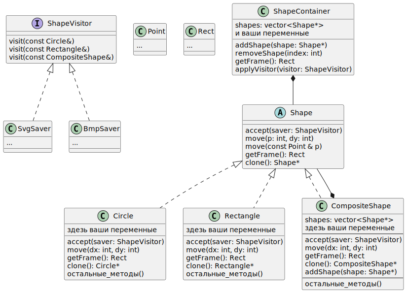

Домашнее задание: Реализация фигур и сохранения фигур в формате SVG и BMP с использованием паттерна Visitor

Требования: вам нужно будет реализовать вот эту [UML Диаграмму классов](https://ru.wikipedia.org/wiki/%D0%94%D0%B8%D0%B0%D0%B3%D1%80%D0%B0%D0%BC%D0%BC%D0%B0_%D0%BA%D0%BB%D0%B0%D1%81%D1%81%D0%BE%D0%B2), используя только стандарнтые библиотеки.


Создать базовый класс Shape с чисто виртуальными методами (не имеют реализации), в том числе accept(ShapeVisitor& visitor), который принимает посетителя. Один метод move(const Point & p) должен быть НЕ виртуальным (используйте Шаблон невиртуального интерфейса NVI).  getFrame возвращает рамку в которую вписана ваша фигура или набор фигур; 

Реализовать классы Circle, Rectangle, CompositeShape, наследующие Shape, которые переопределяют виртуальные методы. 
Создайте для каждого класса свои разумные методы (например getRadius) которые, вам понадобятся в Visitor;

Создать интерфейс ShapeVisitor, содержащий три метода visit для разных типов фигур.

Реализовать класс SvgSaver, который наследуется от ShapeVisitor и реализует методы visit для обработки каждой фигуры. Конструктор принимает имя файла, ширину, высоту.
Воспользуйтесь std::ofstream второй аргумент для конструктора ofstream должен быть `std::ios_base` (можете его не писать, это значение по умолчанию, но для BmpSaver нужен будет `std::ios::binary`). Не забудьте закрыть файл в деструкторе.

Svg файл должен выглядеть вот так:


```svg
<svg xmlns="http://www.w3.org/2000/svg" width="600" height="600">
    <rect x="100" y="100" width="200" height="100" stroke="black" fill="none" />
    <rect x="200" y="100" width="300" height="300" stroke="black" fill="none" />
    <circle cx="250" cy="250" r="100" stroke="black" fill="none" />
</svg>
```


Реализовать класс BmpSaver, который сохраняет изображение фигур в формате BMP. опять std::ofstream, но уже в двоичном режиме `std::ios::binary` ; Конструктор принимает имя файла, ширину, высоту. 
Фигуры не закрашиваем, рисуем только периметр.

в файле bmp есть заголовок (вообще говоря они бывают разные), вам понадобится его заполнить и записать; 
По сути вам нужно дозаполнить поля `bfSize`, `biWidth`, `biHeight`;  `bfSize` - это размер заголовка и данных в байтах.
и запиcать содержимое структуры в файл, а после записать массив чисел (каждый пиксель представлен 3мя байтами), размер массива в байтах (3*width*hight), в массиве цвета пикселей идут другом в порядке: blue, green, red. Пиксели компактно хранятся слева направо, сверху вних.


```cpp

#pragma pack(push, 1) // эта директива не входит в стандарт 
// но поддерживается большинством копиляторов. 
// указывает выравнивание упаковки для элементов структуры
// в данном случае без нее после bfType в памяти был бы пробел в два байта 
// и итоговый размер структуры был бы равен 16 байтам а нам нужно 14.
// (перед bfSize, в заголовке bmp файла пробела не должно быть)
// 

struct  BitmapFileHeader {
    uint16_t bfType = 0x4D42;
    uint32_t bfSize ;
    uint16_t bfReserved1 = 0;
    uint16_t bfReserved2 = 0;
    uint32_t bfOffBits = 54;
};

struct  BitmapInfoHeader {
    uint32_t biSize = 40;
    int32_t biWidth;
    int32_t biHeight;
    uint16_t biPlanes = 1;
    uint16_t biBitCount = 24;
    uint32_t biCompression = 0;
    uint32_t biSizeImage = 0;
    int32_t biXPelsPerMeter = 2835;
    int32_t biYPelsPerMeter = 2835;
    uint32_t biClrUsed = 0;
    uint32_t biClrImportant = 0;
};

struct  BitmapHeader {
    BitmapFileHeader f_h_;
    BitmapInfoHeader i_h_;
};
#pragma pack(pop)

```

Проверьте размер структуры на этапе компиляции с помощью static_assert.
должно быть: sizeof(BitmapInfoHeader) == 40 , sizeof(BitmapFileHeader) == 14, sizeof(FullHeader) == 54  .
Чтобы записать структуру воспользуйтесь приведением типа указателя на структуру.