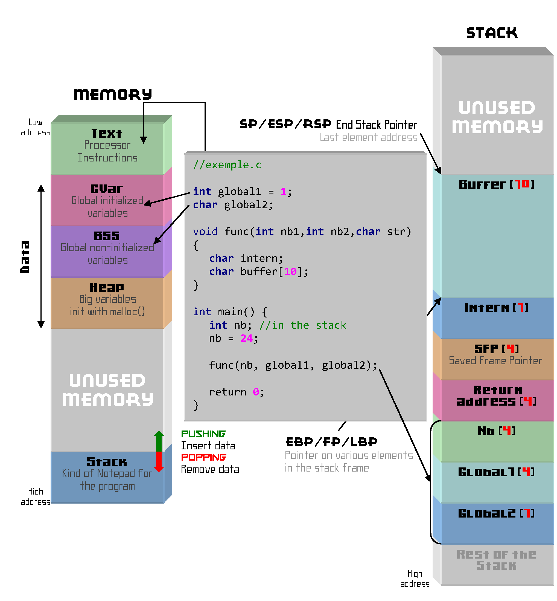
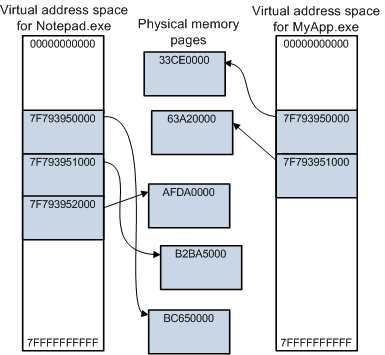

<style >
:not(h1){
  font-size: 23px
}
</style>

# Работа с памятью.   

---


---

# Устройство памяти процесса

- Сегмент кода (text)
- Сегмент данных:
  - GVAR Глобальные переменные (инициализируются)
  - BSS  (static переменные внутри функций и не только)
  - Heap (куча)
- Stack (стек)



---
# Страничная память


Каждый процесс использует адреса виртуального пространства адресов, которую ОС отображает на физическую, выделяя процессу страницы по 4kb 

избежать фрагментацию
- CPU + MMU (Memory Management Unit) преобразуют виртуальные адреса в физические на лету (делается аппаратно).
- изоляция процессов (OC следит за )
- страницы только для чтения и неисполняемые
- swapping ( перемещение обычно неактивного процесса или его части из ОЗУ на жёсткий диск)
- отображение в память файлов 
- разделяемая процессами общая память





---

# Сonstructors and destructors
Конструкторы не имеют имен, вызываются при инициализации и не могут быть вызваны напрямую.
- Сначала вызываются конструкторы базовых классов.
- Потом вызываются конструкторы членов класса по порядку объявления.
- В последнюю очередь – тело конструктора самого производного класса.

```cpp
class FooDefault {
    public:
    //default constructor (конструктор который иожет быть вызван бе аргументов)
    FooDefault () { size_ = 100; }
    FooDefault (size_t size)  { size_ = size; } //конструктор с аргументами 
    ~FooDefault () { } //destructor (вызывается, когда объект уничтожается)
    int size_;
    std::string a = "abcd";
};
```

---
# Деструктор
Деструктор неявно вызывается всякий раз, когда заканчивается время жизни объекта , в том числе:

- завершение программы , для объектов со статической продолжительностью хранения выход из потока, для объектов с длительностью хранения локального потока
(начиная с C++11)
- конец области действия, для объектов с автоматической продолжительностью хранения и для временных объектов, срок действия которых был продлен путем привязки к ссылке
- delete-expression , для объектов с динамической длительностью хранения
- конец полного выражения, для безымянных временных
- раскручивание стека для объектов с автоматической продолжительностью хранения, когда исключение выходит из их блока, не перехвачено.

---

# implicitly defined constructor and destructor

```cpp
class Foo {
    public:
    //default constructor неявно определен, 
    // так как нет других конструкторов определенных пользователем 
    // Конструктор по умолчанию для класса T тривиален 
    // (т.е. не выполняет никаких действий)
    //default destructor неявно определен. Если неявно объявленный деструктор не удален, 
    // он неявно определяется (то есть тело функции генерируется и компилируется) 
    // компилятором 
    ~Foo () { }
    int size_; // здесь после создания обьекта будет мусор 
    std::string a ="abcd"; // а здесь нет 
};

```
---
# оператор sizeof 

- Запрашивает размер объекта или типа.
- Используется, когда необходимо знать фактический размер объекта.
- вычисляется на этапе компиляции.
- в большинстве случаев он вам не понадобится
```cpp
int a;
std::cout << sizeof(a);       // 4 
std::cout << sizeof(double);  // 8
std::cout << sizeof(Foo);  // 40
std::cout << sizeof(*a);     // 8 
std::cout << sizeof(std::string); // 32 
```


---
#  Операторы new и delete:

- new – выделяет память в куче и вызывает конструктор.
- delete – освобождает память и вызывает деструктор.
- new[] – выделяет память под массив объектов в куче и использует default constructor (другие типы конструкторов не используются). для каждого элемента
- delete[] – освобождает память массива и вызывает деструкторы.
```cpp
int* p = new int(10);  // Выделение памяти и инициализация числом 
int* foo_p = new Foo;  // Выделение памяти / вызов 
delete p;              // Освобождение памяти

int* arr = new int[n];  // Массив из n элементов
int* foo_arr = new Foo[n]; // Maccив объектов foo
delete[] arr;           // Освобождение
```

--- 
# Неудачное выделении памяти

Оператор new при неудачном выделении памяти бросает исключение std::bad_alloc
```cpp
try {
    int* p = new int[1000000000];  // Попытка выделить много памяти
} catch (const std::bad_alloc& e) {
    cout << "Ошибка выделения памяти: " << e.what() << endl;
}
```

Можно использовать без исключений, тогда при неудачном выделении памяти 
`new` вернет указатель равный 0; 
```cpp
int* p = new (nothrow) int[1000000000];
if (p!=nullptr) {
    cout << "Ошибка выделения памяти" << endl;
}
```


---
# Ошибки при работе с динамической памятью:
- Утечки памяти – если забыть delete после new.
- Двойное освобождение – если вызвать delete дважды.
- Использование освобождённой памяти – обращение после delete.
- Отсутствие delete[] для массивов – массивы освобождаем delete[].

---

# еще раз стек и куча 


<table>
<tr></tr>
<tr><td>

```cpp
class Foo {
  public:
  Foo ()  {
    p_ = new(std::nothrow) int [100]; // 
    if (p_==nullptr) 
      std::cout<< "bed alloc"<<std::endl;
    else size_ = 100;
  }
  ~Foo () { delete[] p_ }
  int *p_ = nullptr;
  size_t size_ = 0; 
};
void bar( const Foo & ){
  Foo c;
  ...
}

int main(){
    Foo a;
    Foo b; 
    bar(b);
}
```
</td></tr> </table>


---
# объявление и определение конструкторов и методов

```cpp
// foo.h
class Foo {
    public:
    Foo ();
    Foo (size_t size) ;
    ~Foo ();
    ...
    Foo &operator=(const Foo &arg);
    int *p_ = nullptr;
    size_t size_ = 0;
};
```

```cpp
// foo.cpp
Foo::Foo(){ ... }
Foo & Foo::operator=( const  Foo & arg ){ ... }

```


---

# Виды конструкторов и операторов присваивания

```cpp
class Slave {
    public:
    Slave ();
    Slave (size_t size) ;
    ~Slave ();
    Slave (Slave && arg);
    Slave (const  Slave & arg);
    Slave &operator=(const Slave &arg); 
    Slave &operator=(Slave &&arg); \\ перемещающий
    int *p_ = nullptr;
    size_t size_ = 0;
};
```
