<style >
:not(h1){
  font-size: 21px
}
</style>

# Умные указатели и std .


---

# Умные указатели 


  - Мимикрируют под обычные указатели
  - представляют собой RAII классы
  - часто поддерживают тот же интерфейс, что и обычные указатели: op->, op* , op< (например, чтобы положить в std::set)
  - управляют временем жизни объекта 
  - вовремя вызывают деструкторы и освобождают память

Получение ресурсов как инициализация или RAII — это метод программирования на языке C++, который связывает жизненный цикл ресурса, который должен быть получен перед использованием (выделенная динамическая память, поток выполнения, открытый сокет, открытый файл ..).  RAII гарантирует, что все ресурсы будут освобождены, когда закончится время жизни их контролирующего объекта, в обратном порядке получения.

---

# Почему умные указатели?
- Автоматическое освобождение памяти при удалении самого указателя
- Безопасность исключений 

```cpp
void foo(){
  shared_ptr<my_class> ptr(new my_class("arg"));
  // or shorter and better definition:
  auto ptr = make_shared<my_class>("arg");
  ptr->bar(); // if throws exception, nothing bad happened
}

void foo(){
  my_class* ptr = new my_class(/*...*/);
  ptr->bar(); // oops, troubles in case of exception
  delete ptr; // common trouble is to forget to call delete
}
```
---

# Некоторые умные указатели 

- std :: unique_ptr
- std :: shared_ptr
- std :: weak_ptr

---

# std :: unique_ptr


Владеет объектом эксклюзивно

- Нельзя копировать, но можно перемещать!
- Можно положить в stl контейнеры. Но осторожно!
- Удобно использовать при возврате из функции
- release(), Освобождает право собственности на управляемый объект, если таковой имеется. возвращает указатель
- можно (лучше делать редко) использовать get() - для получения сырого указателя


---
# std :: unique_ptr
```cpp
#include <cassert>
#include <iostream>
#include <memory>
 
struct Foo{
    Foo() { std::cout << "Foo\n"; }
    ~Foo() { std::cout << "~Foo\n"; }
};
 
// Ownership of the Foo resource is transferred when calling this function
void legacy_api(Foo* owning_foo){
    std::cout << __func__ << '\n';
    delete owning_foo;
}
 
int main(){
    std::unique_ptr<Foo> managed_foo(new Foo);
    legacy_api(managed_foo.release());
    assert(managed_foo == nullptr);
}
```


---

# std :: shared_ptr

- Поддерживает общий счетчик ссылок на выделенный объект
- Удаляет объект только, когда последний из ссылающихся shared_ptr’ов удаляется или принимает указатель на другой объект


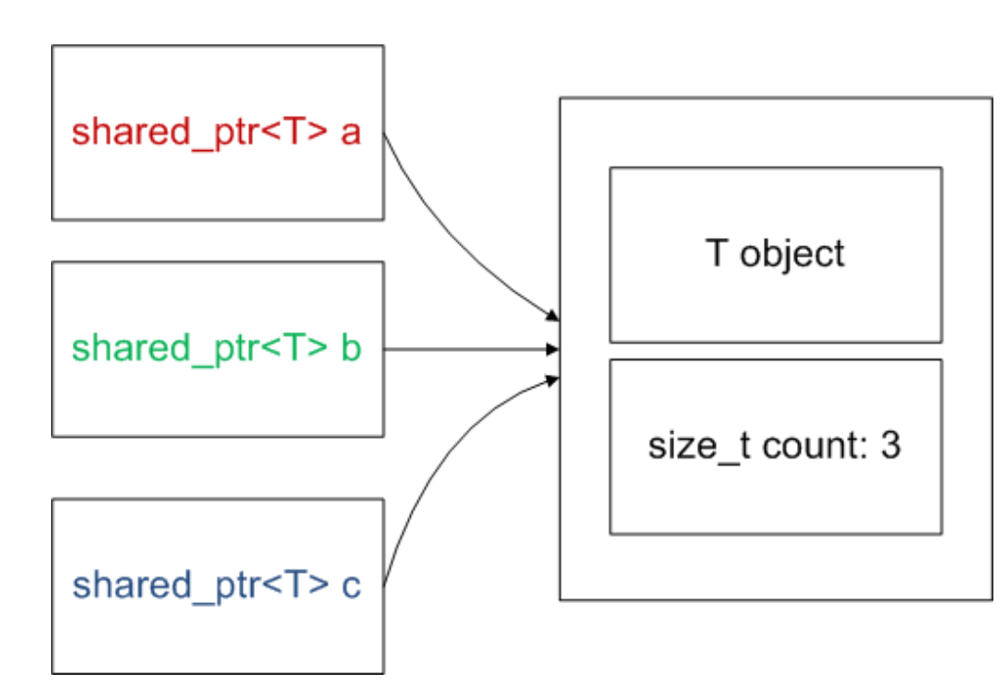


---

# std :: shared_ptr

- используется для разделения владением (имеет счетчик указателей, когда 0 объект удаляется)
- Можно возвращать из функций.
- *Можно передавать между модулями - запоминает правильную функцию удаления (из нужной библиотеки)

```cpp
template<class T> struct shared_ptr {
  /* more than scoped_ptr has */
  shared_ptr(shared_ptr const & r);
  template<class Y> shared_ptr(shared_ptr<Y> const & r);
  shared_ptr(shared_ptr && r);
  template<class Y> shared_ptr(shared_ptr<Y> && r);
  bool unique() const;
  long use_count() const;
  /*...*/
};
```

---

# std :: shared_ptr

- Можно класть в STL контейнеры (есть даже сравнение)
- Полный тип требует только нa момент инициализации!
- Избегайте циклов (используйте weak_ptr)
- Не передавайте временные shared_ptr:

```cpp
void foo(shared_ptr<A> a, int){/*...*/}
int bar() {/*may throw exception*/}
int main() {
  // dangerously
  foo(shared_ptr<A>(new A), bar());
}
```

---

# std::make_shared, std::make_unique

```cpp

int bar() {
  // место возможных утечек в случае исключений
  foo(unique_ptr<X>(new X(10)), unique_ptr<Y>(new Y(100)));
  //  лучше так 
  foo(make_unique<X>(10), make_unique<Y>(100));
  // ...
  return 0;
}
```

---


# std::weak_ptr

```cpp
#include <iostream>
#include <memory>
 
std::weak_ptr<int> gw;
void observe(){
    std::cout << "gw.use_count() == " << gw.use_count() << "; ";
    // we have to make a copy of shared pointer before usage:
    if (gw.expired())
      std::cout << "gw is expired\n";

    if (std::shared_ptr<int> spt = gw.lock())
      std::cout << "*spt == " << *spt << '\n';
    else
      std::cout << "gw is expired\n";
}
int main(){
    {
        auto sp = std::make_shared<int>(42);
        gw = sp;
 
        observe();
    }
    observe();
}

```


---


# Еще немного про new (Placement new)


```cpp

{
    // Statically allocate the storage with automatic storage duration
    // which is large enough for any object of type “T”.
    alignas(T) unsigned char buf[sizeof(T)];
 
    T* tptr = new(buf) T; // Construct a “T” object, placing it directly into your 
                          // pre-allocated storage at memory address “buf”.
 
    tptr->~T();           // You must **manually** call the object's destructor
                          // if its side effects is depended by the program.
}  


```


---

# Контейнеры последовательностей https://hackingcpp.com/cpp/std/library.html

- `array<T,size>` 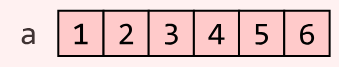

- `vector<T>` 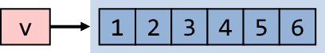

- `deque<T>` 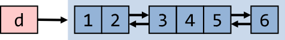 (вообще говоря, эта картинка не самая удачная)

- `list<T>` 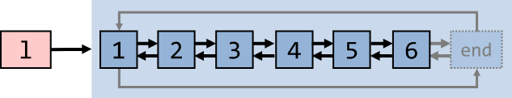

- `forward_list<T>` 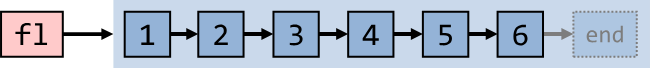

- `string` 


---

# Вектор 


  - `begin` - итератор указывающий на первый элемент, `end` - one_behind_last_element 
  - `operator[]` доступ к указанному элементу 
  - `at` доступ к указанному элементу с проверкой границ, Если вне диапазона контейнера, выдается исключение типа std::out_of_range .
  - `front`, `back`
  - `empty` проверка на пустоту, `size` - возвращает количество элементов 
  - `reserves` - резервирует заранее память 
  - `capacity` - емкость, сколько объектов можно разместить без выделения памяти
  - `shrink_to_fit` уменьшает использование памяти за счет освобождения неиспользуемой памяти
  - `push_back` - добавляет элемент в конец (либо копированием, либо перемещением)
  - `emplace_back` - конструирует элемент на месте 
  


---

# Итераторы 

Итераторы — это обобщение указателей , позволяющее программе на C++ работать с различными структурами данных (например, контейнерами и диапазонами (начиная с C++20) ) единообразно. Библиотека итераторов предоставляет определения для итераторов, а также черты итераторов, адаптеры и служебные функции.

Поскольку итераторы являются абстракцией указателей, их семантика является обобщением большей части семантики указателей в C++. Это гарантирует, что каждый шаблон функции , принимающий итераторы, работает также и с обычными указателями.


---

# Инвалидация итератора

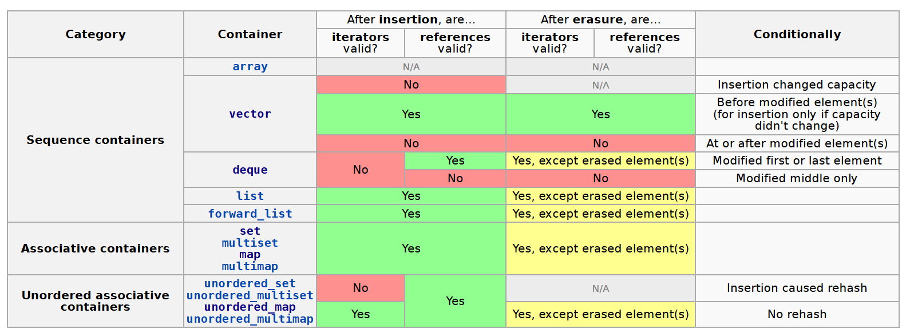


---

# Ассоциативные контейнеры

<table>
<tr></tr>
<tr><td>

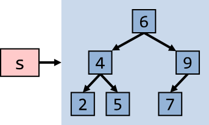

</td><td>

`set<Key>` хранит уникальные ключи; сортируется по ключам.

</td></tr> 


<tr><td>

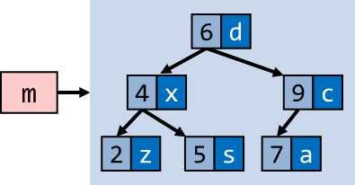
</td><td>

`map<Key,Value>` хранит уникальные пары ключ+значение; сортируется по ключам.
</td></tr> 


<tr><td>

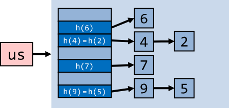
</td><td>

`unordered_set<Key>` хранит уникальные ключи; хэшируется по ключам
</td></tr> 


<tr><td>

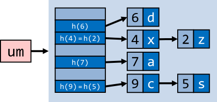 
</td><td>

`unordered_map<Key,Value>` хранит уникальные пары ключ+значение; хэшируется по ключам
</td></tr> 

</table>

упорядоченные ассоциативные контейнеры могут использовать методы  .lower_bound(key) (первый элемент не меньший чем ключ ), .upper_bound(key) (первый элемент больший чем ключ ).


---

# Параметры контейнеров 


- template< class Key, class T, class Compare = std::less<Key>, class Allocator = std::allocator<std::pair<const Key, T>>
- template< class Key, class T, class Hash = std::hash<Key>, class KeyEqual = std::equal_to<Key>, class Allocator = std::allocator<std::pair<const Key, T>>

```cpp
#include <iostream>
#include <map>
#include <utility>
struct ModCmp {
    bool operator()(int lhs, int rhs) const {
        return (lhs % 97) < (rhs % 97);
    }
};

int main() {
    std::map<int, char, ModCmp> cont;
    cont = {{1, 'a'}, {2, 'b'}, {3, 'c'}, {4, 'd'}, {5, 'e'}};
}
```

```


```
std::map<int, std::string> myMap = {{1, "one"}, {2, "two"}, {3, "three"}};
auto it = myMap.upper_bound(2); // Ищем первый ключ > 2

if (it != myMap.end()) {
    std::cout << "Следующий элемент после ключа 2: " << it->first << " = " << it->second << std::endl;
}
```


