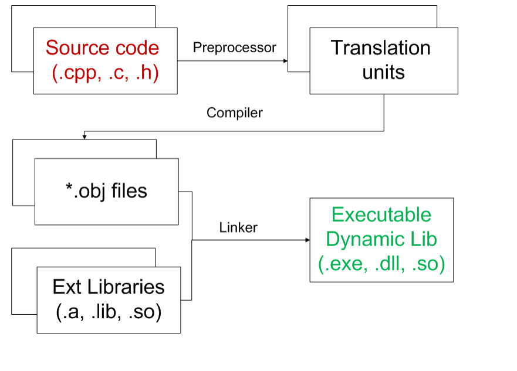
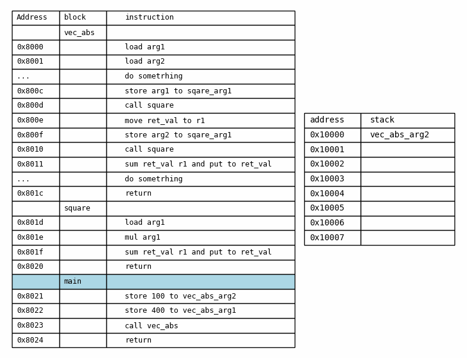
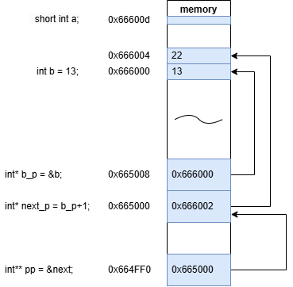

[comment]: <> ( <!-- _backgroundColor: white -->)
# Lecture 1. Building C++ applications  

---

Konstantinov Savva 

- (2019 – 2022) "Элистех" (developing onboard measurement systems)
FPGA and c++ programmer and an electronic engineer.
developed a highly specialized jit compiled functional language based on LLVM backend
- (2017 – 2019) “Конвед-6 ЛИИ” (same) FPGA and c++ programmer.
- graduated from MEPhI (elementary particle physics) and RTU MIREA ( industrial informatics)
- Now MSc Scoltech stutent (Life Sciences) 

---

# Compilation





---------------------------

# Preprocessor С++ 

performs text replacements and other manipulations with the text of source files, resulting in a single file.
```clang++ -E -P -nostdinc main.cpp -o output.cpp```


@{{inline_table}}{src/example_1/main.cpp;src/example_1/my_header.h;src/example_1/output.cpp}

---------------------------

# Preprocessor С++ (not only `#include` directive)

-P removes #line directives that the compiler introduces to identify line and file numbers.
-E displays the result of the preprocessor.

- [conditionally](https://en.cppreference.com/w/cpp/preprocessor/conditional) compile parts of source file (controlled by directive `#if`{:.cpp}, `#ifdef`, `#ifndef`, `#else`, `#elif`, `#elifdef`, `#elifndef`(since C++23), and `#endif` ).
- [replace](https://en.cppreference.com/w/cpp/preprocessor/replace) text macros while possibly concatenating or quoting identifiers (controlled by directives `#define` and `#undef`, and operators `#` and `##`).
- [include](https://en.cppreference.com/w/cpp/preprocessor/include) other files (controlled by directive `#include` and checked with `__has_include`(since C++17)).


---

# Preprocessor С++ (not only `#include` directive)


@{{inline_table}}{src/example_2/main.cpp;src/example_2/my_header.h;src/example_2/output.cpp}


## Don't use `#define` in vain, it's bad form and leads to errors.

---

# Preprocessor С++ (preprocessor options)

- we can define macro from command line 
```clang++ -E -P -nostdinc main.cpp -o output.cpp -DFOO_IFS_H -DSOMETHING_ELSE=1000```  
([other preprocessor options](https://clang.llvm.org/docs/ClangCommandLineReference.html#preprocessor-options))
- we can define paths to search for include files
```clang++  main.cpp -o output.cpp -Ifoo/bar```
([Include path management](https://clang.llvm.org/docs/ClangCommandLineReference.html#include-path-management))
- сommand line arguments may differ between compilers, for exaple MSVC analog for -I is /I

---

# Preprocessor С++ (preprocessor options)

```clang++ -E -P -nostdinc main.cpp -o output_d.cpp -DFOO_IFS_H```

@{{inline_table}}{src/example_2/main.cpp;src/example_2/my_header.h;src/example_2__/output.cpp}


---

<style scoped>
:not(h1){
  font-size: 19px
}
</style>


# First program (strange Hello World)

@{{inline_table_hless}}{src/example_3/main.cpp;src/example_3/my_math.h;src/example_3/my_math.cpp}


```bash
clang++ -c main.cpp -o main.o 
clang++ -c my_math.cpp -o my_math.o
clang++ main.o my_math.o -o program.exe
```

What if we replace ```clang++ -c main.cpp -o main.o``` with ```clang++ -c main.cpp -o main.o -DMY_MATH_H``` ?


---


# First program (strange Hello World)


```cpp
main.cpp:8:20: error: use of undeclared identifier 'add'
    8 |                 << add(x, y)
      |                    ^
main.cpp:12:20: error: use of undeclared identifier 'multiply'
   12 |                 << multiply(x, y)
      |                    ^
2 errors generated.
```

---

# Why do we need header?

@{{inline}}{src/example_3/my_math.h}

## And why do we need a declaration separate from the definitions?


---

# And why do we need function declaration? 

```cpp
int vec_abs(int a, int b);
int square(int a);
```

the compiler must know what to store in the registers/stack before calling the function




---
# External linkage 

@{{inline_table_hless}}{src/conflict_linkage/main.cpp;src/conflict_linkage/external.cpp}


```
clang++ main.cpp external.cpp -o program.exe
```

<div class="hidden">

```log
external-1c7ca5.o : error LNK2005: "int __cdecl foo(void)" (?foo@@YAHXZ) already defined in main-c670e8.o
external-1c7ca5.o : error LNK2005: "int __cdecl func(void)" (?func@@YAHXZ) already defined in main-c670e8.o
external-1c7ca5.o : error LNK2005: "float b" (?b@@3MA) already defined in main-c670e8.o
program.exe : fatal error LNK1169: one or more multiply defined symbols found
clang++: error: linker command failed with exit code 1169 (use -v to see invocation)
```
</div>

---
# External linkage 

@{{inline_table_hless}}{src/conflict_linkage/main.cpp;src/conflict_linkage/external.cpp}

```log
external-1c7ca5.o : error LNK2005: "int __cdecl foo(void)" (?foo@@YAHXZ) already defined in main-c670e8.o
external-1c7ca5.o : error LNK2005: "int __cdecl func(void)" (?func@@YAHXZ) already defined in main-c670e8.o
external-1c7ca5.o : error LNK2005: "float b" (?b@@3MA) already defined in main-c670e8.o
program.exe : fatal error LNK1169: one or more multiply defined symbols found
clang++: error: linker command failed with exit code 1169 (use -v to see invocation)
```

---

# Internal linkage 
const objects, constexpr objects, static objects in namespace scope, objects in anonymous namespace

@{{inline_table_hless}}{src/internal_linkage/main.cpp;src/internal_linkage/internal.cpp}

```
clang++ main.cpp internal.cpp -o program.exe
```


---

# Fundamental types (a small step to the side)

<style scoped>
:not(h1){
  font-size: 19px
}
</style>

<table>
<tr><th> integer </th><th>boolean and float</th></tr>
<tr><td>


|    type name     | (at least) | LLP64(Win) | LP64(Unix)  | literal        |
|------------------|------------|------------|-------------|----------------|
| char             |     8      |  8         |  8          | 'a','c',10i8   |
| short int        |     16     |  16        |  16         |   33s, 0x11    |
| int              |     16     |  32        |  32         | 11, 0x43, 0b10 |
| long int         |     32     |  32        |  64         |  8l, 0x77l     |
| long long int    |     64     |  64        |  64         | 16ll, 0x32ll   |

</td><td>

|   type name     |       literal        |
|-----------------|----------------------|
|long double      | 6.626e-34L           |
|double           | 2.71, .56, 2., 6e24  |
|float            |      3.1415f         |
|bool             |  true, false         |
|void             | empty set of values  |


</td></tr> </table>

modifier `unsigned` can be applied to all integer types. example `unsigned long int a = 10ul` .
char8_t (since C++20),  char16_t, char32_t types for UTF-8, UTF-16, UTF-32 .
keyworf `typedef` can be used to define synonym of the type.
```cpp
typedef unsigned int uint32_t;
```

---

# Pointer types 

<table>
<tr></tr>
<tr><td>

```cpp

    ...

    short int a;
    int b =13 ;
    int* b_p = &b;
    int* next_p = b_p+1;
    int** pp = &next;

    ...

```
</td></tr> </table>



# First look at C++ classes

<table>
<tr></tr>
<tr><td>

```cpp

class B{
    public:
    char b;
    B* next;
    int c;
};

```

</td><td>

```cpp

class B{
    public:
    char b;
    int c;
    B* next;
};

```
</td></tr> </table>

what's the difference?

---

[Simple control structures](https://en.cppreference.com/w/cpp/language/statements)


```cpp

// functions_1.cpp
#include <iostream>
#include "functions_1.h"

void checkNumber(int number) {
    if (number > 0) {
        std::cout << "The number is positive." << std::endl;
    } else if (number < 0) {
        std::cout << "The number is negative." << std::endl;
    } else {
        std::cout << "The number is zero." << std::endl;
    }
}

void printForLoop() {
    std::cout << "Counting from 1 to 5 using for loop:" << std::endl;
    for (int i = 1; i <= 5; ++i) {
        std::cout << i << " ";
    }
    std::cout << std::endl;
}

```

---

[Simple control structures](https://en.cppreference.com/w/cpp/language/statements)

```cpp

// functions_2.cpp 
#include <iostream>
#include "functions_2.h"


void printWhileLoop() {
    std::cout << "Counting from 5 to 1 using while loop:" << std::endl;
    int count = 5;
    while (count > 0) {
        std::cout << count << " ";
        --count;
    }
    std::cout << std::endl;
}

void processSwitchCase() {
    std::cout << "Enter a number from 1 to 3: ";
    int choice;
    std::cin >> choice;

    switch (choice) {
        case 1:
            std::cout << "You selected one." << std::endl;
            break;
        case 2:
            std::cout << "You selected two." << std::endl;
            break;
        case 3:
            std::cout << "You selected three." << std::endl;
            break;
        default:
            std::cout << "Invalid selection!" << std::endl;
    }
}


```